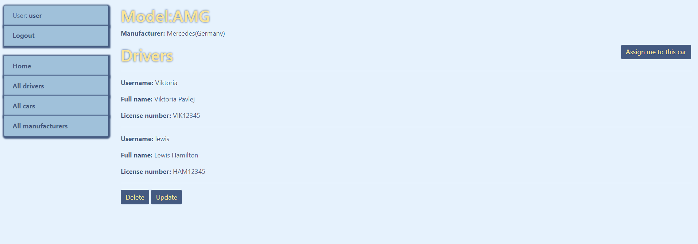

# Taxi Service Project

Django project for managing cars and drivers in the Taxi Service

## Try it!

[Taxi Service project deployed to Heroku](https://taxi-service-ma.herokuapp.com/)

Use the following user to log in and check the functionality of the website: 

```shell
login: user
password: user12345
```

## Installation 

Python3 must be already installed

```shell
git clone https://github.com/pavlejviki/taxi-service-mate
cd taxi-service-mate
python3 -m venv venv
source venv/bin/activate  # on macOS
venv\Scripts\activate  # on Windows 
pip install -r requirements.txt
python manage.py migrate
python manage.py runserver #starts Django Server
```

## Features

* Authentication functionality for Driver/User
* Managing cars, drivers & manufacturers directly from website interface
* Powerful admin panel for advanced managing

## Demo




